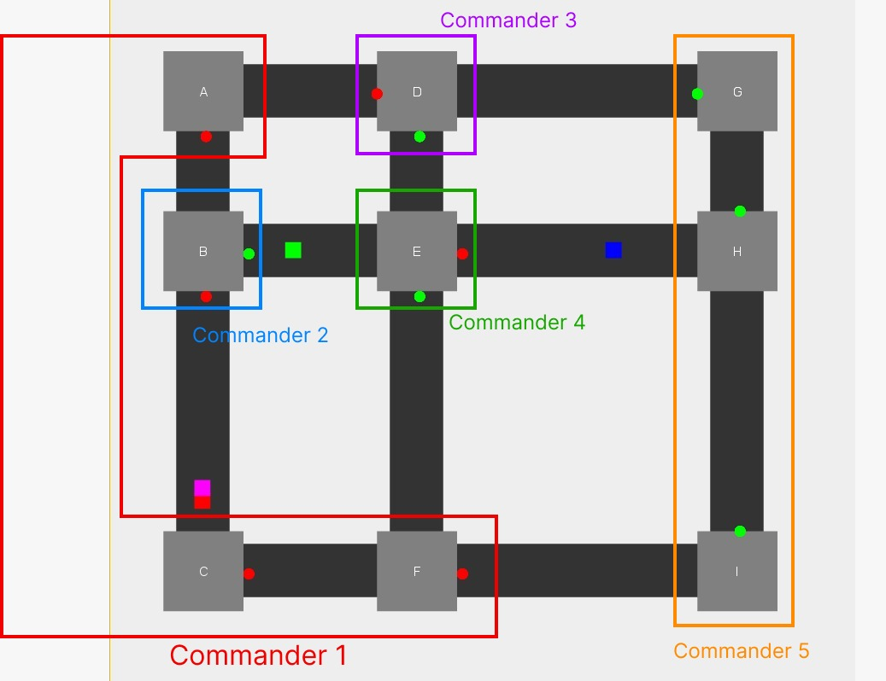

# Cars n' Lights

### Paradigma Sistema Multiagentes

---

**Disciplina**: FGA0210 - PARADIGMAS DE PROGRAMAÇÃO - T01 <br>
**Nro do Grupo**: *Grupo 04*<br>
**Paradigma**: Sistema Multiagentes<br>

## Alunos

|Matrícula | Aluno |
| -- | -- |
| 20/0014447  |  André Corrêa da Silva |
| 19/0012200  |  Douglas da Silva Monteles |
| 18/0015834  |  Eliseu Kadesh Rosa Assunção Jr. |
| 20/0030469  |  Felipe Candido de Moura |
| 20/0018167  |  Gabriel Mariano da Silva |
| 19/0089601  |  João Lucas Pinto Vasconcelos |
| 15/0141629  |  Matheus Pimentel Leal |
| 19/0036940  |  Rafael Fernandes Amancio |
| 19/0038926  |  Victor Eduardo Araújo Ribeiro |

## Sobre

O presente projeto visa simular o comportamento do trânsito de uma cidade, incluindo **veículos**, **semáforos**, **controladores de semáforos**, **pedestres**, e **faixas de pedestre**, sendo estes representados enquanto agentes que interagem entre si e com os elementos da cidade.

O propósito do projeto é exercitar o **Paradigma Sistema Multiagentes**, de modo que todos os elementos supracitados apresentem comportamentos autônomos, capacidade de reação a estímulos e capacidade de possível comunicação com os demais agentes.

<!-- Descreva o seu projeto em linhas gerais. 
Use referências, links, que permitam conhecer um pouco mais sobre o projeto.
Capriche nessa seção, pois ela é a primeira a ser lida pelos interessados no projeto. -->

## Screenshots

### Projeto

Em andamento.

### Semáforos e *Commanders*

A interface do projeto apresenta elementos existentes em um cenário cotidiano do ambiente de locomoção urbano: ruas, cruzamentos, automóveis e semáforos.

No contexto do projeto, há uma série de semáforos em variados cruzamentos, sendo estes implementados como agentes e comandados por alguns agentes "especiais", os **commanders**.

Os **commanders** são os agentes responsáveis por controlar a mudança de estado de um subgrupo de semáforos, de modo que a alternância de estado destes seja determinada através de mensagem enviada por estes aos seus respectivos semáforos.

No projeto, há doze semáforos ao todo, sendo estes divididos nas "áreas de influência" de cinco **commanders** diferentes, conforme mostra a imagem abaixo:



Vale destacar que as os semáforos são representados pelas "circunferências" localizadas ao lado de cruzamentos, podendo estes adotar duas diferentes cores: verde (quando aberto) e vermelho (quando fechado).


*Acima, as duas possíveis representações dos semáforos.*

Já os veículos são representados por "quadrados" com cores aleatórias que se movem ao longo das vias e cruzamentos, como pode ser visto abaixo:


*Acima, algumas das possíveis representações dos veículos.*

<!-- Adicione 2 ou mais screenshots do projeto em termos de interface e/ou funcionamento. -->

## Instalação

**Linguagens**: **Java** <br>
**Tecnologias**: **JADE**, **Java Swing**, **Maven**, **JDK versão 17 e JRE**<br>

<!-- Descreva os pré-requisitos para rodar o seu projeto e os comandos necessários.
Insira um manual ou um script para auxiliar ainda mais.
Gifs animados e outras ilustrações são bem-vindos! -->

## Uso

Antes de seguir os passos de execução do projeto em sua máquina, garanta que ela possua o [**JDK v17**](https://www.oracle.com/br/java/technologies/downloads/#java17) e o [**JRE**](https://www.java.com/pt-BR/download/manual.jsp) instalados. Caso tenha dúvidas, siga as orientações da subseção **Instalação e Configuração do JDK e JRE** na seção **Outros**.

### Ambiente Linux

Para a execução do projeto em ambiente, primeiramente clone o repositório em sua máquina:

```
git clone git@github.com:UnBParadigmas2023-1/2023.1_G4_SMA_Cars_n_Lights.git
```

Logo após, vá para a pasta *cars-n-lights*, onde o projeto está localizado:

```
cd 2023.1_G4_SMA_Cars_n_Lights/cars-n-lights/
```

Então, com o terminal aberto no diretório em questão, rode o seguinte comando:

```
make build-and-run
```

### Ambiente Windows

Após garantir que o **Git** está instalado e configurado em sua máquina *Windows* (caso contrário, instale a partir [DAQUI](https://git-scm.com/download/win)), clone o repositório em sua máquina:

```
git clone git@github.com:UnBParadigmas2023-1/2023.1_G4_SMA_Cars_n_Lights.git
```

Logo após, vá para a pasta *cars-n-lights*, onde o projeto está localizado:

```
cd .\2023.1_G4_SMA_Cars_n_Lights\cars-n-lights\
```

Agora, é necessário que sua máquina seja capaz de executar os comandos presentes no arquivo [**Makefile**](./cars-n-lights/Makefile). Para tal, siga os passos do seguinte [**TUTORIAL**](https://linuxhint.com/run-makefile-windows/). Uma vez que seu dispositivo é capaz de executar o **Makefile**, siga o comando:

```
make build-and-run-win
```

<!-- Explique como usar seu projeto.
Procure ilustrar em passos, com apoio de telas do software, seja com base na interface gráfica, seja com base no terminal.
Nessa seção, deve-se revelar de forma clara sobre o funcionamento do software. -->

## Vídeo

Em andamento.

<!-- Adicione 1 ou mais vídeos com a execução do projeto.
Procure: 
(i) Introduzir o projeto;
(ii) Mostrar passo a passo o código, explicando-o, e deixando claro o que é de terceiros, e o que é contribuição real da equipe;
(iii) Apresentar particularidades do Paradigma, da Linguagem, e das Tecnologias, e
(iV) Apresentar lições aprendidas, contribuições, pendências, e ideias para trabalhos futuros.
OBS: TODOS DEVEM PARTICIPAR, CONFERINDO PONTOS DE VISTA.
TEMPO: +/- 15min -->

## Participações

Abaixo, as informações relativas à área e à significância da contribuição de cada membro ao projeto:

|Nome do Membro | Contribuição | Significância da Contribuição para o Projeto |
| -- | -- | -- |
| André Corrêa da Silva           | Participação em andamento. |  Em andamento.  |
| Douglas da Silva Monteles       | Participação em andamento. |  Em andamento.  |
| Eliseu Kadesh Rosa Assunção Jr. |  Participação em andamento. |  Em andamento.  |
| Felipe Candido de Moura         | Desenvolvimento dos Semáforos e Commanders (e suas devidas particularidade) e Documentação  |  Em andamento.  |
| Gabriel Mariano da Silva        | Desenvolvimento dos Semáforos e Commanders (e suas devidas particularidade) e Documentação |  Em andamento.  |
| João Lucas Pinto Vasconcelos    | Participação em andamento. |  Em andamento.  |
| Matheus Pimentel Leal           | Participação em andamento. |  Em andamento.  |
| Rafael Fernandes Amancio        | Participação em andamento. |  Em andamento.  |
| Victor Eduardo Araújo Ribeiro   | Participação em andamento. |  Em andamento.  |

## Outros

### Lições Aprendidas

- Em andamento.

### Percepções

- Durante o desenvolvimento do projeto foram encontradas dificuldades relativas à configuração do ambiente. Como os diferentes membros do grupo usam variados *sistemas operacionais*, a configuração das tecnologias necessárias para a execução do projeto adotou certo grau de dificuldade, que exigiu pesquisa e cooperação entre os membros para a resolução dos mesmos;
- Em andamento;

### Contribuições e Fragilidades

- Em andamento.

### Trabalhos Futuros

- Em andamento

<!-- Quaisquer outras informações sobre o projeto podem ser descritas aqui. Não esqueça, entretanto, de informar sobre:
(i) Lições Aprendidas;
(ii) Percepções;
(iii) Contribuições e Fragilidades, e
(iV) Trabalhos Futuros. -->

### Instalação e Configuração do JDK e JRE

Ter o **Java Development Kit (JDK)** e o **Java Runtime Environment (JRE)** instalados em sua máquina é essencial para a execução do projeto. Para tal, siga os tutoriais de instalação dos *softwares* em questão para cada sistema operacional no qual se deseja executar o projeto.

#### Ambiente Linux

Para a instalação do *JDK* (versão 17) e do *JRE* em sua máquina com *Linux*, recomenda-se o acesso ao tutorial mais "agradável" para a resolução de sua dúvida dentre as seguintes opções:

- [Página de Download do JDK 17](https://www.oracle.com/br/java/technologies/downloads/#java17): baixe a versão mais adequada para o seu sistema operacional;
- [Documentação da *Oracle* para instalação do JDK em plataforma *Linux*](https://docs.oracle.com/en/java/javase/17/install/installation-jdk-linux-platforms.html#GUID-737A84E4-2EFF-4D38-8E60-3E29D1B884B8): apesar de seu conteúdo ser relativamente denso e avançado, é possível compreender como se dá a instalação do *JDK* em ambiente *Linux*;
- [Guia de instalação do *Oracle Java 17* no *Ubuntu 22.04*](https://www.fosstechnix.com/install-oracle-java-17-on-ubuntu-22-04-lts/): mais "palatável" que o tutorial anterior, este também apresenta como proceder para instalar o *JDK versão 17* em sua máquina *Linux*;
- [*Downloads* do *Java* para Todos os Sistemas operacionais](https://www.java.com/pt-BR/download/manual.jsp): Uma das formas de se proceder com a instalação do *JRE* é instalar a versão mais adequada para a sua máquina.
- [Guia do *Ubuntu* para instalação do *OpenJDK JRE*](https://ubuntu.com/tutorials/install-jre#1-overview): O tutorial apresenta um passo a passo para a instalação do *OpenJDK JRE*, bastando apenas que se atente para a instalação da versão *LTS* do *OpenJDK JRE* (conforme nota apresentada em *link* do segundo passo do tutorial).

#### Ambiente Windows

Para a instalação do *JDK* (versão 17) e do *JRE* em sua máquina com *Windows*, recomenda-se o acesso ao tutorial mais "agradável" para a resolução de sua dúvida dentre as seguintes opções:

- [Página de Download do JDK 17](https://www.oracle.com/br/java/technologies/downloads/#java17): baixe a versão mais adequada para o seu sistema operacional;
- [*Downloads* do *Java* para Todos os Sistemas operacionais](https://www.java.com/pt-BR/download/manual.jsp): Uma das formas de se proceder com a instalação do *JRE* é instalar a versão mais adequada para a sua máquina.
- [Guia de instalação do *JDK* no *Windows, Mac* e *Linux*](https://www.geeksforgeeks.org/download-and-install-java-development-kit-jdk-on-windows-mac-and-linux/): O guia apresenta um passo a passo intuitivo de instalação do *JDK versão 17* e de configuração das variáveis de ambiente no *Windows*;
- [Guia de instalação do *JRE* em ambiente *Windows*](https://support.quest.com/pt-br/kb/4229374/jre-version-1-8-or-above-installation-for-microsoft-windows): O breve tutorial apresenta imagens do passo a passo na instalação do *JRE* no *Windows*.

## Fontes

- **JADE - JAVA Agent Development Framework**. Disponível em: <https://jade.tilab.com/>;
- **How to Run a Makefile in Windows**. Disponível em: <https://linuxhint.com/run-makefile-windows/>;
- **JADE API Documentation**. Disponível em: <https://jade.tilab.com/doc/api/index.html>;
- **Java downloads - JDK 17**. Disponível em: <https://www.oracle.com/br/java/technologies/downloads/#java17>;
- **Installation of the JDK on Linux Platforms**. Disponível em: <https://docs.oracle.com/en/java/javase/17/install/installation-jdk-linux-platforms.html#GUID-737A84E4-2EFF-4D38-8E60-3E29D1B884B8>;
- **"How to Install Oracle Java 17 on Ubuntu 22.04 LTS" por Shweta Mamidwar**. Disponível em: <https://www.fosstechnix.com/install-oracle-java-17-on-ubuntu-22-04-lts/>;
- **Downloads do Java para Todos os Sistemas Operacionais**. Disponível em: <https://www.java.com/pt-BR/download/manual.jsp>;
- **Install the Java Runtime Environment**. Disponível em: <https://ubuntu.com/tutorials/install-jre#1-overview>.
- **JRE(version 1.8 or above) Installation for Microsoft Windows (4229374)**. Disponível em: <https://support.quest.com/pt-br/kb/4229374/jre-version-1-8-or-above-installation-for-microsoft-windows>.
- **Download and Install Java Development Kit (JDK) on Windows, Mac, and Linux**. Disponível em: <https://www.geeksforgeeks.org/download-and-install-java-development-kit-jdk-on-windows-mac-and-linux/>.

<!-- Referencie, adequadamente, as referências utilizadas.
Indique ainda sobre fontes de leitura complementares. -->
